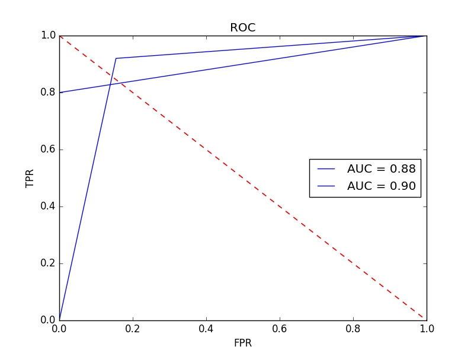

# Spam_Detector
垃圾分类
===========================
# 一.配置环境
## 1.运行环境
* Windows 10 x64
* python 3.5
## 2.依赖的python包
* sklearn
* pandas
* numpy
* nltk
* random
* pickle
# 二.文件说明
## 输出运行目录
+ model 为模型保存的文件夹
    * NB_model.model 是朴素贝叶斯模型
    * RF_model.model 是随机森林模型
    * vectorizer.model 是TF-IDF模型（特征提取模型）
+ ROC 为模型输出结果ROC曲线的图
    * NB_roc.jpg 是朴素贝叶斯模型输出的ROC曲线
    * RF_roc.jpg 是随机森林模型输出的ROC曲线
+ resource_data 为源文件
    * spam.csv 是原下载的数据集
    * stopwords.txt 是从网上下载的停用词（英文 + 标点）
+ flask_test.py 是flask api接口开发
+ genenrate_model.py 是生成模型文件，同时也是整个搭建模型的过程（函数式编程）
+ package_API.py 是封装了模型类，也包含了模型的所有过程（面向对象），
    * class Spam_Detector() 提供完整接口，并且包含建模的所有过程
    * class One_record_test() 提供对于输入一条记录，输出结果的类，供给flask测试
+ corpus.csv 是利用源文件输出的TF-IDF模型的语料库
+ spam_new.py 是利用源文件输出的整理后的数据集
+ read_me.md 是模型构建和文件的解释说明
# 三.模型评价指标
## 1.朴素贝叶斯模型
####（1）训练集上进行10次交叉验证的结果求平均值，准确性是86.6%
####（2）模型的准确率，查全率，f1得分
   | class | precision | recall | f1-score | support |
   |:---:|:---:|:---:|:---:|:---:|
   | 0 | 0.99 | 0.85 | 0.91 | 965 |
   | 1 | 0.48 | 0.92 | 0.63 | 150 |
   | avg/total | 0.92 | 0.86 | 0.87 | 1115 |
#### （3）混淆矩阵
   |Confusion_matrix  | 0 | 1 |
   |:---:|:---:|:---:|
   | 0 | 816 | 149 |
   | 1 | 12 | 138 |
#### （4）ROC曲线

### （5）训练模型时间 ：0:00:11.819382
## 2.随机森林模型
#####（1）训练集上进行10次交叉验证的结果求平均值，准确性是97.1%
####（2）模型的准确率，查全率，f1得分
   | class | precision | recall | f1-score | support |
   |:---:|:---:|:---:|:---:|:---:|
   | 0 | 0.97 | 1.00 | 0.99 | 965 |
   | 1 | 1.00 | 0.81 | 0.89 | 150 |
   | avg/total | 0.97 | 0.97 | 0.97 | 1115 |
#### （3）混淆矩阵
   |Confusion_matrix  | 0 | 1 |
   |:---:|:---:|:---:|
   | 0 | 965 | 0 |
   | 1 | 29 | 121 |
#### （4）ROC曲线

### （5）训练模型时间 ：0:04:13.444018
# 四.样本不均衡问题
由于label = 1 的样本一共是747个（spam），
而label = 0 的样本一共是4825个（ham）。
1:0 = 1:7,造成样本不均衡
+ 一开始想通过在模型中赋予label= 1 更高的权重，但是发现即使这样做了，并不会将假阳性FPR大大降低，实验只能降低一点点，说明作用不大。
+ 之后实验采用对文本数据进行重采样和欠采样：SMOTE+ENN算法。
